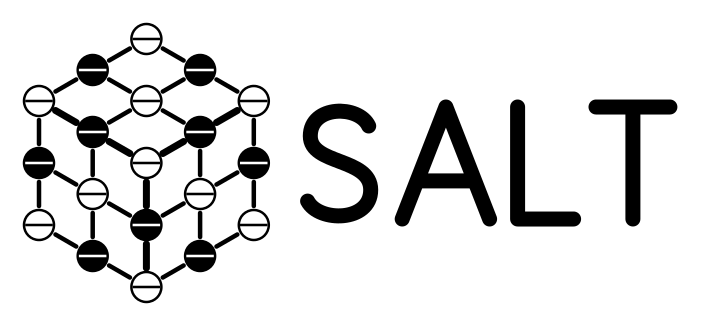

# SALT - State Assured Latent-Trasition engine

**Paper:** [SALT: Reusable Computation for Stateful Language-Model Inference](https://zenodo.org/records/23111764) (Zenodo preprint, 2026).

> **Dry-run public export — not yet a release.**

SALT Core is a portable C99 state-assured latent-transition engine. Its public
contract centers deterministic arithmetic, authenticated model packages, live
state/KV ownership, portable state export/import, and subordinate CPU, Metal,
CUDA, and HIP physical backends.

> [!WARNING]
> Preserved KV/state is more than a saved prompt: it can carry the accumulated
> effects of an agent's automated activity and support continued or branched
> execution. It may also expose sensitive information. These risks exist with
> or without SALT. Retention permission is not unrestricted reuse permission;
> restoring state does not grant authority to act. Read the
> [KV Cache and Persistent Agent State Statement](docs/COGNITIVE-STATE-RISK.md).
> This is a disclosure and responsible-use standard, not a claim of implemented
> safeguards or an amendment to the software license.

The curated runtime source now matches merged private `main` revision
`ce0363260a488c96b951b4d826a188e1014575d4`
(`2026-10-02T10:58:17-04:00`) for the exported runtime paths. This updates
source bytes, not the historical proof pins or platform qualification. It
contains no model weights. Model artifacts retain their own licenses and must
be obtained separately.

The scoped [formal proof bundle](docs/FORMAL-PROOFS.md) contains executable TLA+
models and TLAPS proof sources. Its documented proof boundary is not a claim
that the complete runtime or concrete KV bytes are formally verified.

The refreshed source passed isolated Linux CPU and CUDA builds, focused
KV-compatibility tests, and a curated public `make test` smoke suite covering
configuration, state control, Q4 byte identity, resource binding, and server
framing/session contracts. `make all` and `make -n test all` also pass on Linux.
The public config test now pins the selected Mac Metal recipe's exact values;
the private-source test still has older expectations. The source compatibility
projection preserves the existing logical MLX-Q4 state identity despite the
public Makefile change. No real inference, HIP/Metal build, or complete
state/KV parity was qualified from this exported tree.

The public build, supported-platform, security, contribution, and release
documents are still review gates. Do not publish this dry-run tree.
